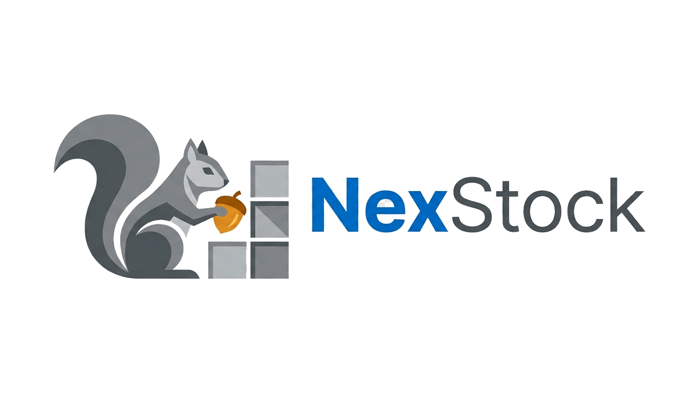
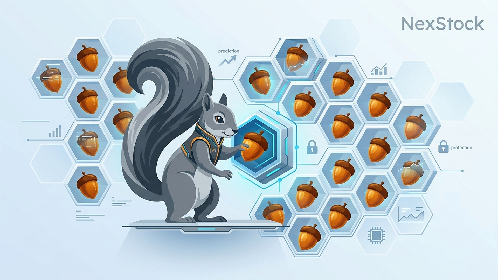
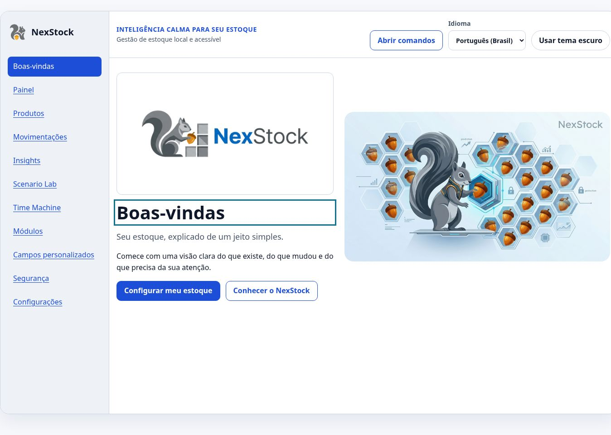
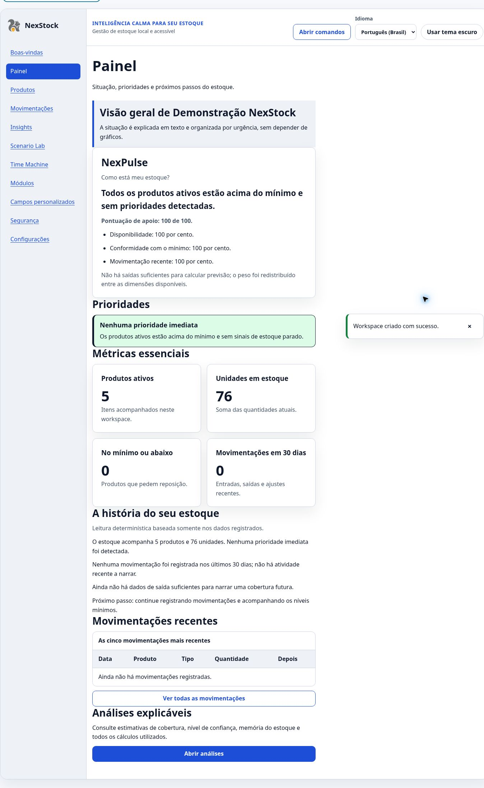

# NexStock



NexStock é uma PWA local-first que transforma registros de estoque em uma
leitura compreensível: situação atual, prioridades, histórico, estimativas
explicáveis e simulações que não alteram os dados reais.

Versão estável: `1.8.0 — Local-first Excellence`. Fases 0 a 66 concluídas; a
próxima entrega é a Fase 67, Large Dataset, da release alvo
`1.9.0 — Professional Polish`.

## Links

- [Aplicação publicada](https://jplima-dev-ai.github.io/NexStock/)
- [Visita guiada em seis etapas](https://jplima-dev-ai.github.io/NexStock/#/tour)
- [Guia de início](docs/getting-started.md)
- [Arquitetura](docs/architecture/overview.md)
- [Implantação no GitHub Pages](docs/deployment/github-pages.md)
- [Blueprint mestre v1.1](NEXSTOCK-BLUEPRINT-v1.1.md)
- [Continuação oficial v1.2](NEXSTOCK-BLUEPRINT-v1.2.md)



## Recursos principais

- NexPulse com resumo textual, pontuação de apoio e prioridades ordenadas.
- Cadastro, busca, filtros, NexCode sequencial e arquivamento lógico.
- Entradas, saídas e ajustes com prévia, auditoria e proteção contra estoque negativo.
- Insights com cobertura estimada, confiança, memória e cálculo reproduzível.
- Scenario Lab e Time Machine sem mutação dos dados durante a simulação.
- Perfis para tecnologia, cosméticos, moda, alimentos e operações personalizadas.
- Módulos de serial, validade, variações, kits, compatibilidade e substitutos.
- Interface em Português do Brasil, inglês dos Estados Unidos e espanhol.
- NexDesign 2.0 com tokens formais, superfícies próprias por tema, iconografia
  controlada e tabelas adaptáveis com ordenação acessível.
- NexMotion com movimentos curtos para rotas, abas, diálogos, navegação,
  estados e feedback, removidos quando movimento reduzido está ativo.
- NexCopy com explicações e exemplos visíveis em campos importantes, ações
  específicas e mensagens que informam o ocorrido, a causa e a recuperação.
- NexCopy contextual com modos guiado e compacto, exemplos adaptados aos cinco
  perfis e glossário pesquisável nos três idiomas.
- NexSettings com nove seções acessíveis por link direto, navegação lateral no
  desktop e seletor de seção no mobile.
- Settings Summary com estados centrais, atalhos, preferências seguras salvas
  imediatamente e confirmação para restauração de dados.
- Import Center para CSV com seleção ou arrastar e soltar, mapeamento de
  colunas, prévia editável, validação por linha, duplicatas e confirmação
  explícita antes da gravação.
- Export Center para produtos, movimentações, lotes, auditoria e workspace,
- NexBackup para cópia completa do workspace, prévia validada e restauração
  transacional após confirmação explícita,
- snapshots locais antes de importações e restaurações, com histórico
  preservado e exclusão sempre confirmada,
  com filtros revisáveis, prévia, CSV seguro, JSON e impressão.
- Command Center 2.0: `Ctrl+K` entende ações direcionadas como “entrada
  Quantum”, “abrir Quantum SSD” e “simular Quantum”, sem tirar as mãos do
  teclado.
- NexQuery converte consultas controladas como “sem estoque”, “produtos
  arquivados” e “buscar Quantum SSD” em filtros locais, visíveis e revisáveis.
- Product Media permite imagem opcional em cada produto, com descrição para
  leitores de tela, thumbnail, Blob local, funcionamento offline e backup.
- NexScan localiza produtos por NexCode, nome completo ou câmera compatível e
  inicia abertura, entrada ou saída, sempre com fallback manual.
- NexLabels gera e imprime etiquetas locais para produto, lote, localização e
  unidade serializada; seus códigos são resolvidos pelo NexScan.
- Mobile Operations 2.0 entrega navegação inferior, ações rápidas, busca e
  scanner próprios para telas pequenas.

## Arquitetura

O frontend usa HTML, CSS e JavaScript com módulos ES, sem framework. A interface
consome serviços de domínio, que dependem do contrato `DataProvider`. O provider
padrão persiste no IndexedDB; uma configuração validada pode selecionar
PostgreSQL/Supabase.

Fluxo principal: `interface → serviços de domínio → DataProvider → banco`.

Consulte a [visão de arquitetura](docs/architecture/overview.md), a
[persistência](docs/architecture/persistence.md) e a
[integração Supabase](docs/architecture/supabase.md). Os contratos de mobilidade
estão em [mobilidade de dados](docs/architecture/data-mobility.md).

## Acessibilidade

A meta é WCAG 2.2 AA onde aplicável. O produto possui HTML semântico, link para
pular conteúdo, foco visível, gerenciamento de foco entre rotas, operação por
teclado, textos além de cor e layout responsivo até zoom de duzentos por cento.
O fluxo principal recebeu teste exploratório positivo com NVDA no Windows.

Consulte a [declaração de acessibilidade](docs/accessibility.md).

## Segurança

NexShield aplica validações de domínio, URLs permitidas, inserção segura de
texto, constraints locais ou PostgreSQL, isolamento por espaço de trabalho e
auditoria. A Central de Segurança relata apenas controles verificáveis e oferece
cinco testes adversariais isolados.

Consulte o [modelo de segurança](docs/security.md).

## PWA e funcionamento offline

O manifest permite instalação, e o service worker mantém um cache versionado do
shell. O estado da conexão é anunciado, atualizações são aplicadas por ação
explícita e rascunhos ficam no dispositivo. A atualização da aplicação não
apaga o IndexedDB.

## Screenshots

### Boas-vindas



### Painel com dados de demonstração



As imagens complementam a documentação. Todos os fluxos importantes permanecem
descritos em texto e operáveis sem depender delas.

## Executar localmente

Pré-requisito: Node.js 20.11 ou superior.

```bash
npm start
```

Abra `http://localhost:4173/nexstock/#/welcome` ou o endereço informado pelo
servidor.

## Validar e gerar o site

```bash
npm run validate
npm run build:pages
npm run validate:pages
```

`npm run validate` inclui testes unitários e E2E em Chromium real com
Playwright, axe, IndexedDB, offline, teclado, temas e os três idiomas.

Consulte o [guia de testes](docs/testing.md) para entender cada gate.

## Contribuição e licença

Leia [CONTRIBUTING.md](CONTRIBUTING.md) antes de enviar mudanças. Todos os
direitos estão reservados até que o titular escolha uma licença pública
explícita.
